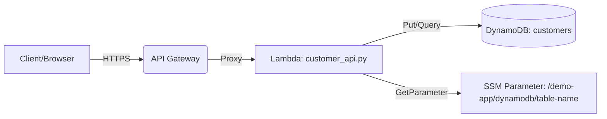

# AWS Delivery Consultant Demo Application

Full-stack serverless demo: API Gateway → Lambda (Python) → DynamoDB, provisioned with Terraform. Designed for quick deploys and portfolio-ready screenshots.

## Architecture



## Validation screenshots

Below are validation screenshots from a live deployment of the basic serverless stack.

1) Terraform outputs


2) API GET /


3) API POST /customers


4) DynamoDB scan


5) Lambda logs (last 10 minutes)


## Quick start

Prereqs: AWS CLI v2, Terraform 1.5+, an AWS profile (SSO or static).

```powershell
cd terraform
terraform init
terraform apply -auto-approve
terraform output -raw api_invoke_url

# Test POST
$base = terraform output -raw api_invoke_url
$body = @{ name = "Jane Doe"; email = "jane@example.com"; company = "Acme Corp" } | ConvertTo-Json
Invoke-RestMethod -Method Post -Uri "$base/customers" -ContentType 'application/json' -Body $body
```

## Repository layout

```
src/
    frontend/index.html
    lambda/customer_api.py
terraform/
    main.tf
    variables.tf
    outputs.tf
docs/
    PROJECT_STATUS.md
```

## Notes
- CORS preflight (OPTIONS) enabled for / and /customers.
- Lambda runtime: python3.11. Uses AWS SDK provided by environment.
- SSM Parameter stores the DynamoDB table name.

## Cleanup
```powershell
cd terraform
terraform destroy -auto-approve
```
