# AWS Delivery Consultant Demo Application

Full-stack serverless demo: API Gateway → Lambda (Python) → DynamoDB, provisioned with Terraform. Designed for quick deploys and portfolio-ready screenshots.

## Architecture

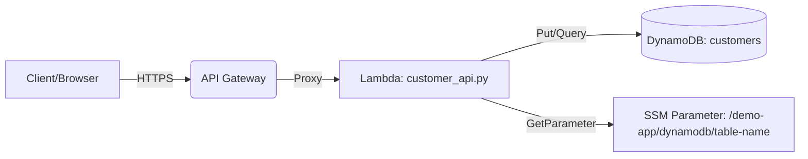

## Validation screenshots

Below are validation screenshots from a live deployment of the basic serverless stack.

1) Terraform outputs
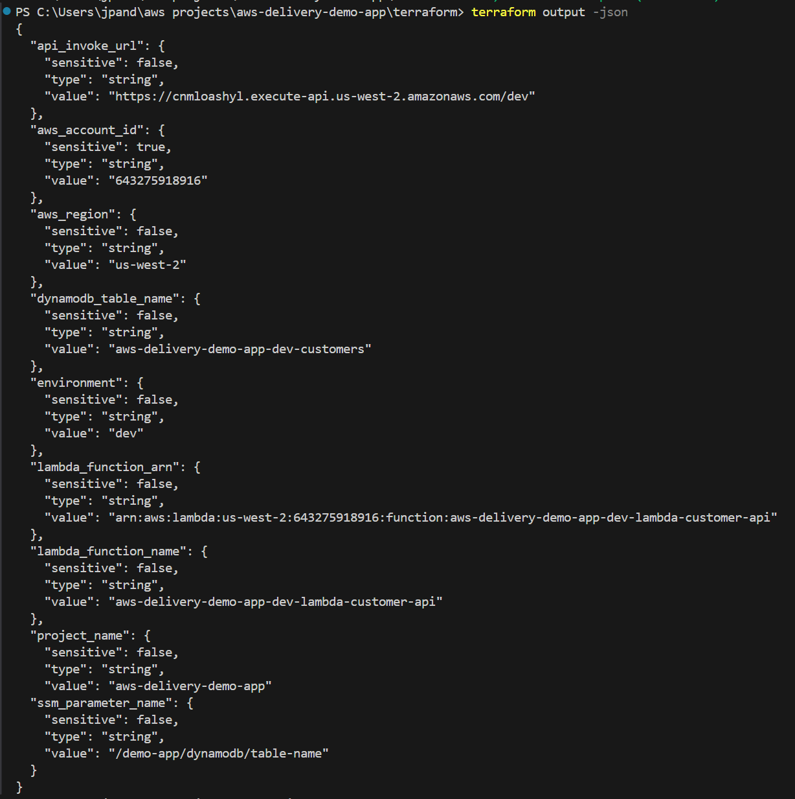

2) API GET /
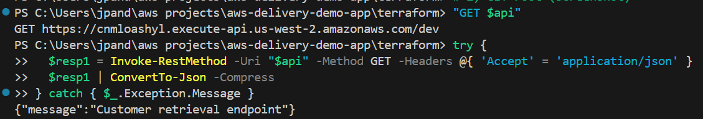

3) API POST /customers
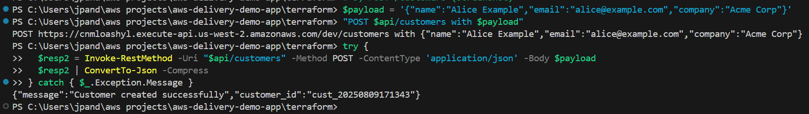

4) DynamoDB scan
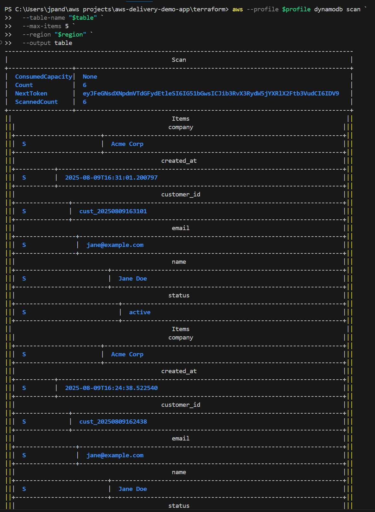

5) Lambda logs (last 10 minutes)
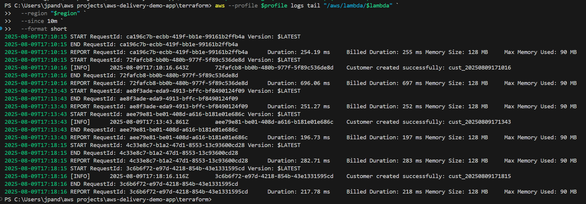

## Live HTML UI (served by Lambda)

The API root (GET /) returns a minimal HTML page to create and list customers—no S3/CloudFront required. Below is a sample flow from a live deployment.

1) Enter customer details and click Create
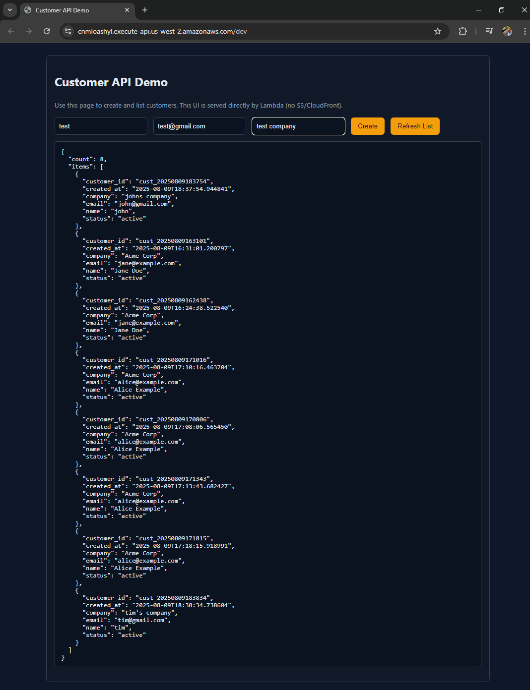

2) Success response with generated customer_id
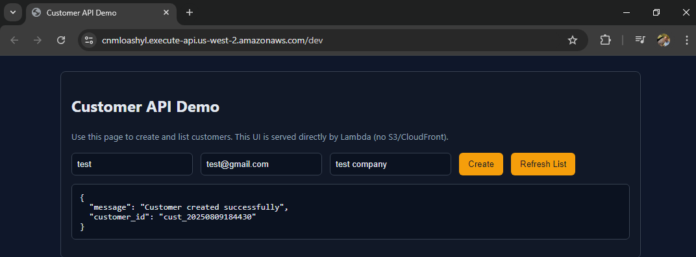

3) Refreshed list including the new record
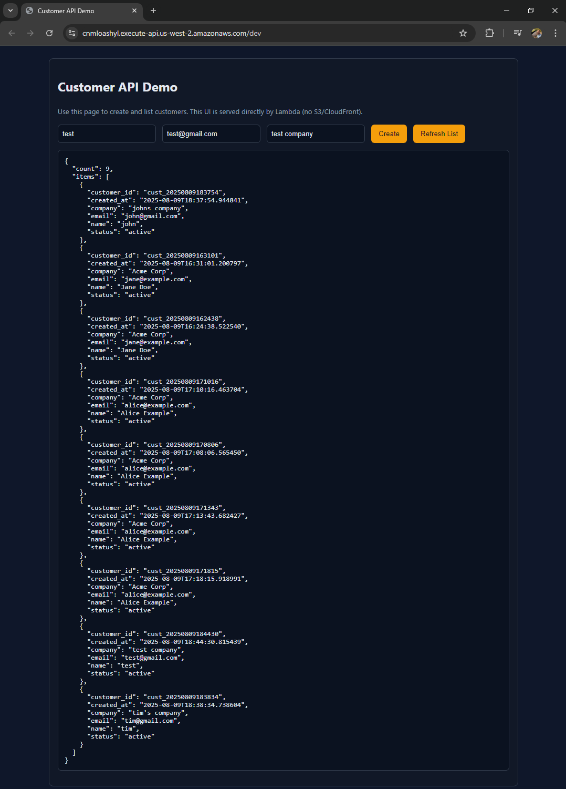

Tip: Save your screenshots with the above filenames into `docs/screenshots/` to render them here.

## Console verification

Spot-checks from the AWS Console for the same deployment:

1) API Gateway
- Overview: 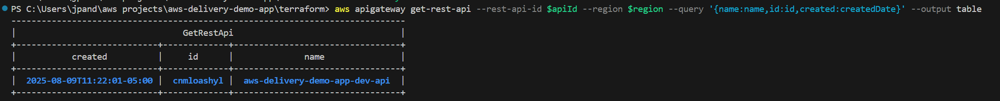
- Resources: 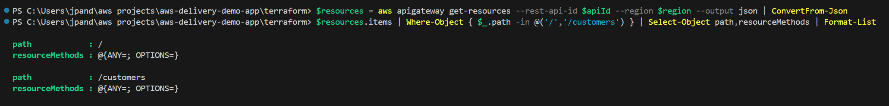
- Stages: 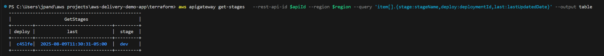

2) Lambda Function
- Function details: 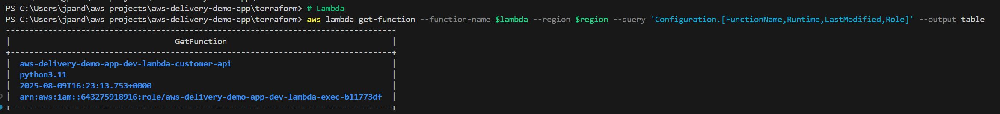
- Code tab: 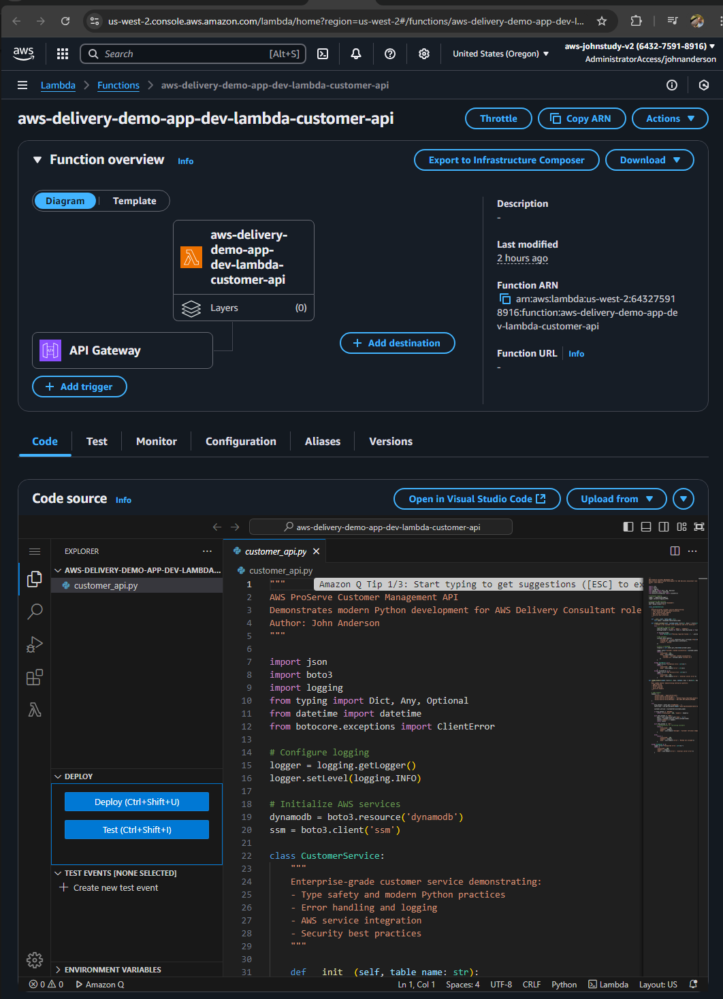

3) DynamoDB Table
- Table list/details: 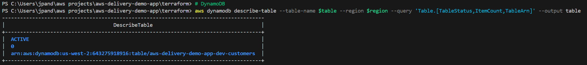
- Console view: 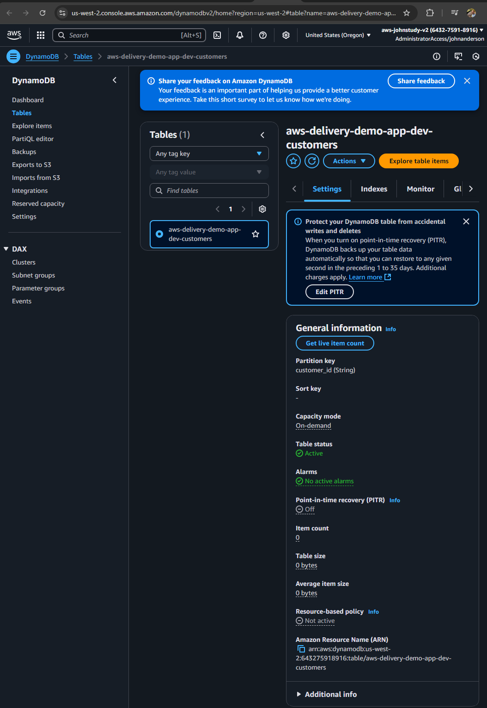
- Sample scan output: 

4) CloudWatch Logs
- Log group: 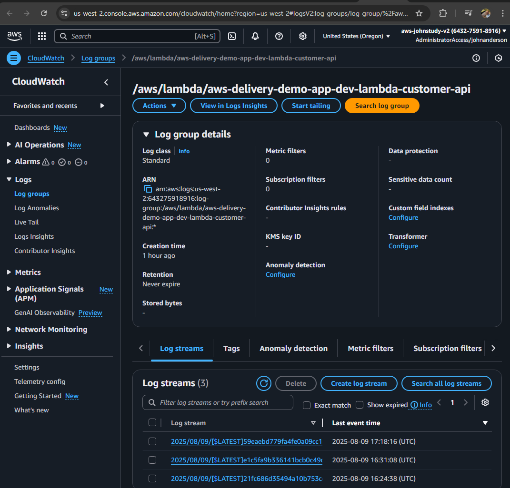
- Recent Lambda logs: 

5) SSM Parameter Store
- Parameter list: 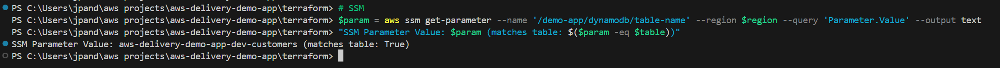
- Console view: 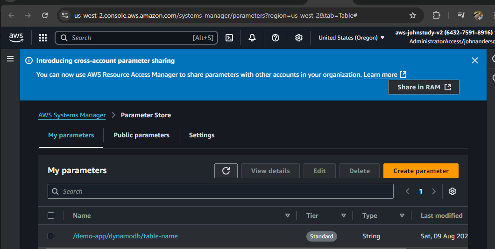

## Quick start

Prereqs: AWS CLI v2, Terraform 1.5+, an AWS profile (SSO or static).

```powershell
cd terraform
terraform init
terraform apply -auto-approve
terraform output -raw api_invoke_url

# Test POST
$base = terraform output -raw api_invoke_url
$body = @{ name = "Jane Doe"; email = "jane@example.com"; company = "Acme Corp" } | ConvertTo-Json
Invoke-RestMethod -Method Post -Uri "$base/customers" -ContentType 'application/json' -Body $body
```

### Quick smoke test

Run an end-to-end smoke test against the deployed API:

```powershell
pwsh -File .\testing\integration\smoke.ps1
```

## Repository layout

```
src/
    frontend/index.html
    lambda/customer_api.py
terraform/
    main.tf
    variables.tf
    outputs.tf
docs/
    PROJECT_STATUS.md
```

## Notes
- CORS preflight (OPTIONS) enabled for / and /customers.
- Lambda runtime: python3.11. Uses AWS SDK provided by environment.
- SSM Parameter stores the DynamoDB table name.

## Cleanup
```powershell
cd terraform
terraform destroy -auto-approve
```
