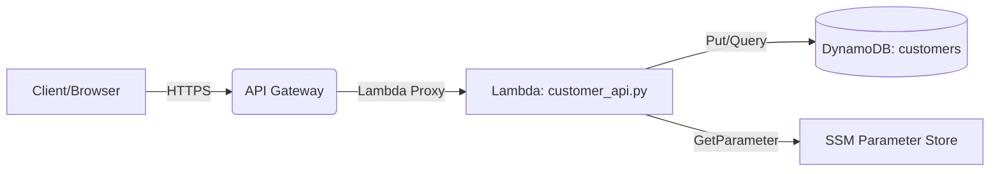

# Architecture

- API Gateway exposes:
  - / (ANY + OPTIONS) → Lambda (for base URL test)
  - /customers (ANY + OPTIONS) → Lambda (POST creates customer)
- Lambda reads table name from SSM Parameter `/demo-app/dynamodb/table-name`.
- DynamoDB table name: `${project}-${env}-customers`.
